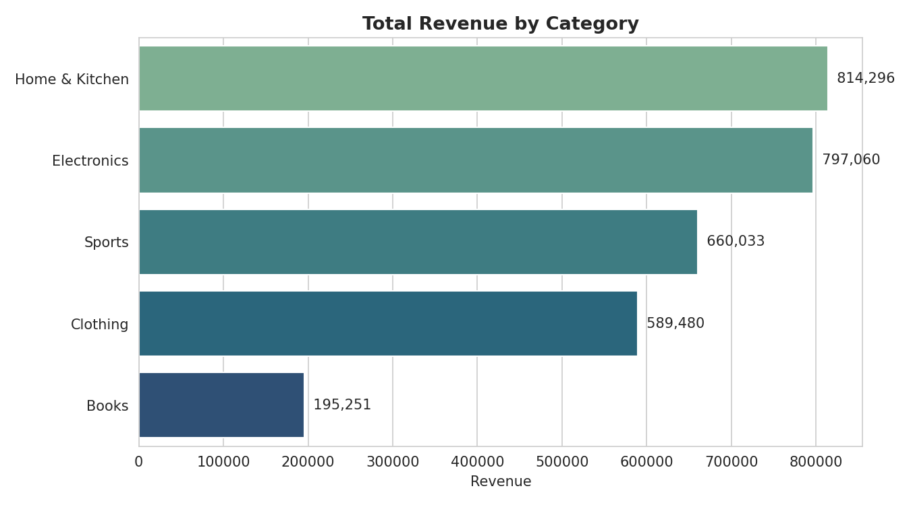
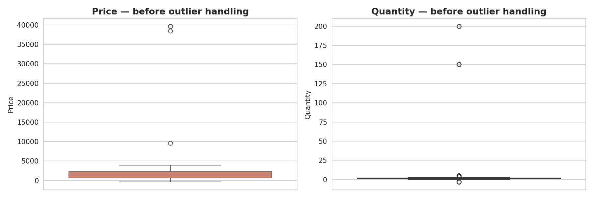
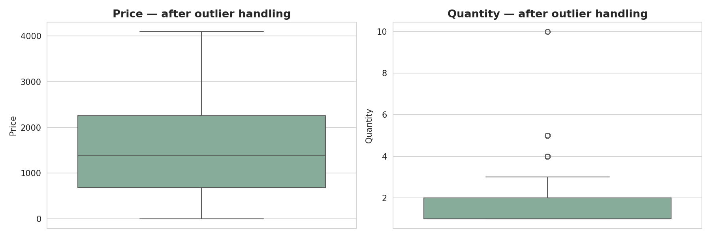
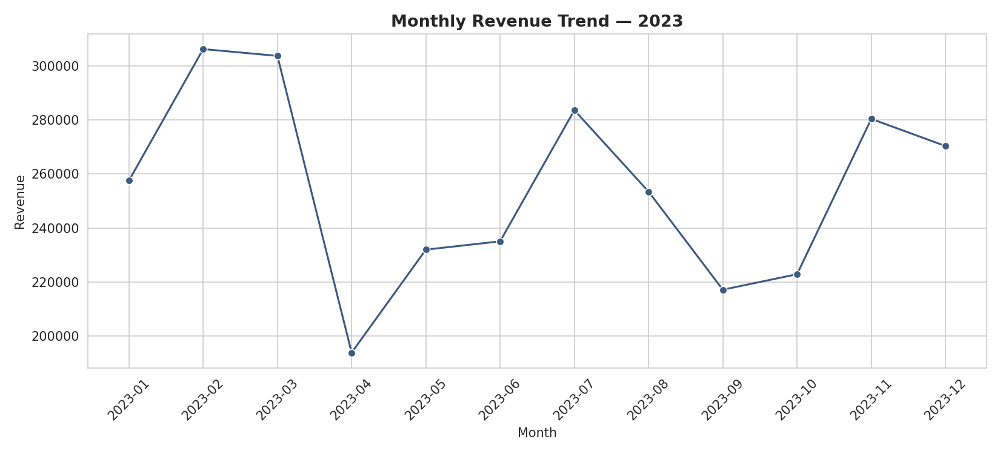

 # Retail Sales — Data Cleaning & Visualization

**By Vicky Harish Kumar Badmera**

An internship project on cleaning a messy retail sales export and pulling insights out of it through visualization. The dataset simulates what you'd actually get from a store's point-of-sale system: missing values, duplicate rows, inconsistent text formatting, mixed date formats, and a few outright data-entry errors.

## Why this project

Real-world data is rarely analysis-ready. Before you can chart anything meaningful, you have to figure out what's broken, decide how to fix it without distorting the results, and document the reasoning so someone else (or future-you) can trust the output. That's what this project focuses on — not just making charts, but getting to a clean, trustworthy dataset first.

## Dataset

`data/raw_sales_data.csv` — 1,224 retail order records across 5 product categories (Electronics, Clothing, Home & Kitchen, Books, Sports), covering orders placed throughout 2023.

Known issues in the raw file:

| Issue | Details |
|---|---|
| Missing values | 147 missing entries spread across `CustomerName`, `Price`, `Quantity`, `OrderDate`, `Region`, `PaymentMethod` |
| Duplicate rows | 23 exact duplicates (likely from overlapping export batches) |
| Inconsistent formatting | Region/category/payment fields mix casing and stray whitespace (`" North "`, `NORTH`, `north`) |
| Mixed date formats | `OrderDate` uses three different formats (`YYYY-MM-DD`, `DD/MM/YYYY`, `MM-DD-YYYY`) depending on which terminal exported it |
| Outliers | A handful of absurd prices (negative values, 15–20x spikes) and quantities (0, negative, 150+ units on one order) |

## What this project does

1. **Load & inspect** — get a real picture of how bad the data is before touching anything
2. **Clean**
   - drop exact duplicate rows
   - standardize text fields (casing, whitespace)
   - parse the three date formats into a single consistent datetime column
   - handle missing values with column-appropriate strategies (median imputation for numeric fields, grouped by category where it matters; `"Unknown"` label for categorical identifiers; row drop only where a date genuinely can't be recovered)
   - cap outliers using the IQR method (applied per category for price, since price ranges genuinely differ across categories)
3. **Visualize** — revenue by category, monthly trend, regional split, top products, payment method mix, order value distribution, weekday pattern, and a category × region heatmap
4. **Summarize findings** in plain language

## Results

| | Before | After |
|---|---|---|
| Rows | 1,224 | 1,189 |
| Missing values | 147 | 0 |
| Duplicate rows | 23 | 0 |

The cleaned dataset is saved to `data/cleaned_sales_data.csv`.

## Project structure

```
retail-sales-project/
├── data/
│   ├── raw_sales_data.csv          # original messy export
│   └── cleaned_sales_data.csv      # output after cleaning
├── notebooks/
│   └── data_cleaning_and_visualization.ipynb   # main analysis notebook
├── outliers_before.png             # exported chart images
├── outliers_after.png
├── revenue_by_category.png
├── monthly_revenue_trend.png
├── orders_by_region.png
├── top_products.png
├── payment_methods.png
├── order_value_distribution.png
├── orders_by_weekday.png
├── category_region_heatmap.png
├── requirements.txt
└── README.md
```

## How to run it

```bash
git clone https://github.com/<your-username>/retail-sales-project.git
cd retail-sales-project
pip install -r requirements.txt
jupyter notebook notebooks/data_cleaning_and_visualization.ipynb
```

## Sample visuals

**Revenue by category**



**Price outliers, before and after cleaning**




**Monthly revenue trend**



## Key findings

- Revenue isn't evenly spread across categories — Home & Kitchen and Electronics lead by a noticeable margin over Books.
- Monthly revenue shows real peaks and dips across the year rather than a flat line, which is worth investigating against any promotions or seasonal effects.
- Order volume is fairly balanced across the five regions, with no single region dominating.
- Card and UPI payments make up the majority of transactions over cash.
- Order value is right-skewed, as expected for retail — most orders are lower value, with a smaller number of larger orders pulling the average up.

## Tools used

- Python 3
- Pandas — cleaning, transformation, aggregation
- Matplotlib & Seaborn — visualization
- Jupyter Notebook

## Next steps

- Bring in cost data to move from revenue to profit margin per category
- Add customer segmentation (RFM analysis) if a repeat-customer identifier becomes available
- Turn the cleaning steps into a standalone script so a new raw export can be reprocessed without touching the notebook

---

*This project was built by Vicky Harish Kumar Badmera as part of a data analytics internship to practice data preprocessing, exploratory analysis, and visual storytelling.*
